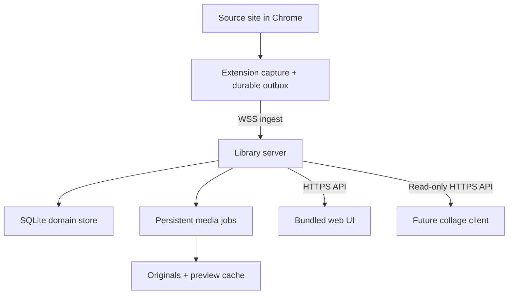
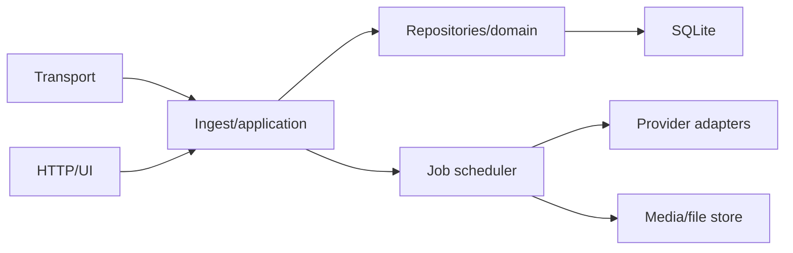

# Archive Library — System Architecture

## Recommended system shape

The deployable is one Node process plus persistent storage. The extension is
the only edge agent.



For Twitter, the source page continues to make all Twitter API requests.
The extension observes responses and sends normalized records to the server.
The server may fetch selected media only from the adapter's explicit CDN
allowlist. It never calls Twitter APIs and never writes to a source service.

## Why a modular monolith

The system's important actions cross several concepts at once:

- ingesting a record can update a post version, account observation, viewer
  relationship, FTS row, and media candidates;
- archiving links a request, job attempt, downloaded blob, media asset, and
  human-readable alias;
- importing may reconcile an existing file with an already-captured post;
- purge must understand shared blobs, generated previews, tags, and import
  provenance before deleting anything.

One SQLite transaction makes these operations deterministic. A separate
capture database and library database would require a transactional outbox,
replication cursors, conflict policy, health monitoring, and a repair tool
before it delivered a single user-facing feature.

The code should nevertheless be organized so each module has one direction
of dependency:



- **Transport:** WebSocket framing, authentication, batching, acknowledgements.
- **Application:** use cases such as ingest batch, archive item, update rating,
  merge/link person, and start import scan.
- **Repositories/domain:** SQL and invariants; no HTTP or filesystem calls.
- **Job scheduler:** durable leases and attempts; invokes adapter/file work.
- **Provider adapters:** provider-specific normalization, URL planning, host
  allowlists, and relationship extraction. No UI or SQL.
- **Media/file store:** atomic writes, hashing, range reads, preview generation,
  and safe path handling.
- **HTTP/UI:** validation and representation only; no raw SQL in route handlers.

## Deployment topology

### Supported first topology: server on the NAS

- Chrome extension on the user's computer.
- Library server in a container or service directly on the NAS/Linux host.
- SQLite, WAL, and temporary download files on a local NAS dataset/volume.
- Original media on a durable NAS dataset mounted into the same container.
- Preview cache on a separate disposable dataset/volume.
- Caddy, nginx, or a private-network ingress terminates TLS and proxies one
  origin to the Node server.

This is the fewest-moving-parts shape. No desktop relay or file sync exists.

### Supported alternative: server beside a mounted NAS

If the application runs on another Linux host:

- keep `library.sqlite3`, its WAL/SHM files, job scratch space, and config on
  that host's local disk;
- mount only the media/archive dataset from the NAS;
- include both the database backup destination and the media dataset in the
  operational backup plan.

Do not place live SQLite or its WAL on SMB/NFS. Network filesystem locking and
durability semantics are not an acceptable archive risk.

### Remote access boundary

The preferred exposure order is:

1. same LAN plus a valid private certificate;
2. Tailscale/WireGuard/private overlay plus HTTPS;
3. authenticated reverse proxy reachable from the Internet only if the owner
   intentionally accepts that operating burden.

Plain `ws://` is accepted only for `127.0.0.1`, `[::1]`, and automated tests.
The extension must refuse a non-loopback insecure endpoint unless an explicit
developer-only override is enabled.

## Evolution of the existing `app/`

Keep the top-level directory and Node/plain-JS constraint. Avoid a repository
rename during the functional migration. Evolve its internals approximately as:

```text
app/src/
  main.js                  composition root and shutdown
  config.js                validated configuration
  transport/               HTTP server, ingest WebSocket, auth
  application/             use-case functions
  db/                      migrations and repositories
  adapters/twitter/        TweetRecord mapper + CDN policy
  jobs/                    scheduler and handlers
  media/                   blob store, aliases, previews, range helpers
  import/                  scans, manifests, format adapters
  web/                     built static UI assets (or build output mount)
```

`packages/core` continues to own the stable Twitter `TweetRecord`, filename,
sidecar, and URL-selection contracts. Generic library contracts can initially
live in `app/` because there is only one consumer process. Move a contract into
a new shared package only when the extension or a separately-built client
actually imports it.

## Migration posture

The server can become remote before the entire generic data migration. Use
two controlled steps:

1. **Remote-ready compatibility release.** Add secure endpoint configuration,
   durable extension delivery, and deployment support while continuing to
   write the existing `posts/versions/media/files` schema and legacy archive
   layout. This gets bytes onto server-managed storage quickly.
2. **Generic library migration.** Introduce schema migrations and the generic
   model in `02-storage-and-files.md`; backfill current rows; switch the
   repositories, downloader, and API to the new model; verify counts/hashes;
   retain legacy tables read-only for one release/backup cycle.

There must never be two independently writable databases. During a brief
schema transition, dual-write within one SQLite transaction is acceptable
only if a backfill/verification test proves equivalence and the removal date
is explicit. Prefer a one-time transactional backfill followed by a single
write path.

## Architectural invariants

1. **Single canonical metadata store.** SQLite is authoritative for library
   relationships and curation. Sidecars are durable export artifacts, not a
   second writable database.
2. **Immutable original blobs.** Once a hash is recorded, a file is never
   modified in place. Replacement content creates a new blob relationship.
3. **Curation is ingest-proof.** Provider capture may update provider-owned
   fields but cannot overwrite ratings, tags, notes, collections, aliases, or
   local favorites.
4. **Provider IDs are namespaced.** No Twitter ID, account handle, or media key
   is globally unique without its service key.
5. **Observation is not truth.** Unknown source relationship/account state is
   stored as unknown, not false. Deletion/suspension labels record evidence and
   time rather than claiming continuous knowledge.
6. **Every external effect is replay-safe.** Ingest events have idempotency
   keys; jobs are durable and leased; file promotion is atomic; import rows
   have batch/source identities.
7. **No arbitrary URL fetch.** Every download URL passes an adapter-specific
   scheme/hostname/path policy after redirects as well as before the request.
8. **No source writes.** Adapter capabilities intentionally omit create,
   like, unlike, bookmark, follow, delete, or profile mutation methods.
9. **Filesystem paths are private implementation details.** Clients receive
   opaque IDs and HTTP URLs, never NAS paths.
10. **Derived data is disposable.** Previews, denormalized search projections,
    and UI caches can be rebuilt from the database and originals.

## Capacity assumptions

SQLite remains the correct default for one owner and a media-heavy workload:
metadata writes are modest, reads are indexed, and media bytes do not pass
through the database. Design and test initially for:

- millions of captured items/versions;
- tens of millions of observation/relationship rows over time;
- tens of terabytes of original media addressed on disk;
- one ingest writer, a small number of job workers, and a handful of UI/API
  readers.

Use WAL, short write transactions, cursor pagination, explicit indexes, and
periodic `ANALYZE`/checkpointing. A PostgreSQL migration is considered only
after measurements show sustained writer contention or a real need for
multiple server processes. It is not a speculative milestone.

## Deliberately deferred architecture choices

- final product/component name;
- public Internet ingress versus private-network-only access;
- whether compatibility filenames are hardlinks, reflinks, or recorded aliases
  on the target filesystem;
- whether video preview extraction uses a bundled `ffmpeg`, a container
  dependency, or poster images until later;
- splitting the web UI into its own repository. The MVP belongs here so the
  API and schema evolve together.

None of these blocks the first remote-ingest and archive vertical slice.
