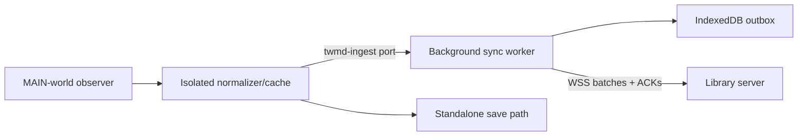

# Archive Library — Capture, Ingest, Adapters, and Jobs

## Outcome

Make the extension a minimal, durable capture edge and make all server work
idempotent/restart-safe. A laptop may sleep, change networks, or lose the NAS
for hours without losing an explicit archive action. Timeline metadata is
retained within a visible, bounded local quota.

## Extension responsibility split

The current content script both holds the pairing token and opens the
WebSocket, with configuration in `x.com` `localStorage`. That is acceptable
for loopback prototyping but not for a remote server: page-origin storage is
the wrong secret boundary, direct content-script networking is exposed to
page CSP/lifecycle behavior, and unacknowledged `seen` frames are lost when
disconnected.

Move connection ownership into the extension background/service-worker side:



- The MAIN-world interceptor remains observe-only.
- The isolated script continues to normalize Twitter payloads with
  `@twmd/core`, update the in-tab cache, and power buttons.
- A new long-lived `chrome.runtime.connect` port (never `sendMessage`, due to
  the documented legacy handler conflict) carries capture events to the
  background worker.
- The background owns `chrome.storage.local` configuration, device secrets,
  IndexedDB outbox, WebSocket lifecycle, acknowledgement deletion, and status.
- The existing standalone `chrome.downloads` save remains usable and separate.

MV3 may suspend the service worker. Design every handler so reopening the
port, a Chrome alarm, a network transition, or a manual status check restarts
the sync loop from IndexedDB. A WebSocket heartbeat may improve continuity but
is not the durability mechanism.

## Device configuration and pairing

Move these values from page `localStorage` to `chrome.storage.local`:

- server HTTPS/WSS base URL;
- opaque device ID;
- device token;
- selected viewer account per service/browser profile;
- outbox quota and optional developer diagnostics.

Restrict the storage area's access to trusted extension contexts with Chrome's
storage access-level control, or keep the device token in background-owned
IndexedDB if mixed content-script settings prevent that restriction. Content
scripts receive only the non-secret connection/status data they need over a
port; page and isolated content code never receive the token.

The options page performs pairing:

1. owner creates a one-time pairing code in the web UI or CLI;
2. extension submits it over HTTPS/WSS and receives a random device token;
3. server stores only a token hash and device metadata;
4. extension stores the token in extension-private local storage;
5. owner can label/revoke the device in the web UI.

Do not put long-lived tokens in URLs, logs, exported diagnostics, page DOM, or
page storage. WebSocket browser APIs cannot set arbitrary Authorization
headers, so the token is sent only in the first protocol frame over WSS.

## Durable outbox

### Event envelope

Every event stored on-device has:

```json
{
  "event_id": "uuid",
  "device_id": "uuid",
  "sequence": 12345,
  "service": "twitter",
  "kind": "content_observed",
  "schema_version": 1,
  "occurred_at_ms": 1783650000000,
  "viewer_account": { "native_id": "..." },
  "payload": {}
}
```

`event_id` is the idempotency key. `sequence` is monotonic per device and is
used for diagnostics/gap reporting, not as the only acknowledgement key.
Events can be coalesced under pressure, so the server/client must acknowledge
specific IDs rather than assuming every sequence exists.

Initial event kinds:

- `content_observed`: normalized item/version/media/account data;
- `content_unavailable`: tombstone/unavailable evidence;
- `archive_requested`: explicit Twitter button action with the current record;
- `viewer_state_observed`: liked/bookmarked evidence when separable from the
  content observation;
- `media_request_profile`: narrow, credential-free CDN request hints if the
  Twitter adapter still needs them;
- `device_status`: optional build/protocol capability snapshot.

Do not send complete raw GraphQL responses. They are large, unstable, and may
contain unrelated account/session data. Send the normalized provider contract
plus explicitly reviewed fields.

### IndexedDB stores

- `outbox`: event envelope, priority, serialized byte estimate, created time,
  last attempt, and optional coalescing key;
- `meta`: device sequence, last successful sync, server capabilities, quota
  counters, and dropped/coalesced counters;
- `dead_letter`: locally invalid events with sanitized error details and an
  expiry/export mechanism.

Insert the event and increment the sequence in one IndexedDB transaction. An
event leaves `outbox` only after the server acknowledges that exact ID as
committed or already processed.

### Bounded retention policy

Defaults should be conservative and configurable after real measurements
(for example, 50,000 events or 256 MiB, whichever comes first):

- explicit `archive_requested` and unavailable/tombstone events are highest
  priority and are never silently coalesced;
- an unacknowledged repeated `content_observed` event for the same provider
  item/version may replace an older observation if no meaningful fields or
  viewer relationship transition would be lost;
- low-priority repeated observations are the first evicted under hard quota;
- dropped/coalesced counts, oldest event age, and quota percentage appear in
  extension status and server device diagnostics;
- quota exhaustion that threatens explicit actions is a visible error, not a
  console-only message.

This is not an infinite offline crawler. The goal is reliable personal use
with honest pressure signals.

## Ingest protocol v2

Keep protocol v1 available on loopback during migration. The remote path uses
v2 with batching and acknowledgements.

### Handshake

Client:

```json
{
  "v": 2,
  "type": "hello",
  "device_id": "uuid",
  "token": "secret",
  "extension_version": "...",
  "provider_contracts": { "twitter": 1 },
  "capabilities": ["batch", "ack", "viewer-state"]
}
```

Server response includes accepted version/capabilities, server time, maximum
frame/batch sizes, and any revoked/incompatible state. Authentication failure
closes with a stable code and disables aggressive reconnect until config or
token changes.

### Batch and acknowledgement

- Client sends at most 100 events and at most 512 KiB serialized per batch by
  default; server-advertised limits win.
- Server validates the whole envelope, then processes valid events in short
  SQLite transactions. It may reject one malformed event without replaying
  already committed siblings.
- `batch_ack` returns each event ID as `accepted`, `duplicate`, `retry`, or
  `rejected`, with stable safe error codes and an optional retry-after.
- `accepted` means canonical projections and the ingest receipt committed.
- `duplicate` means the same event ID/payload hash was already committed and
  is equally safe to delete locally.
- Reuse of an event ID with a different payload hash is a protocol/security
  error and never overwrites the original receipt.
- `retry` stays in the outbox with bounded backoff.
- `rejected` moves to local dead-letter state and is visible to the owner.

The server advertises flow control. The extension has only one or a small
bounded number of batches in flight, uses exponential backoff with jitter, and
honors retry-after responses. Reconnect is safe because every event is
idempotent.

### Server-to-device messages

Keep the channel mostly ingest-only. Initial messages are:

- `batch_ack`;
- `server_status` (queue pressure, version warnings);
- `device_revoked`;
- `ping`/`pong` or WebSocket control heartbeat.

Do not send general library commands into a web page. Archive selections made
in the library UI run server-side from stored media candidates and do not need
the extension online.

## Ingest application flow

For each accepted provider event:

1. authenticate and validate envelope/frame size;
2. insert or find `ingest_receipts(event_id)` and compare payload hash;
3. ask the registered provider adapter to validate/map the payload;
4. upsert service account current projection and append a profile period only
   when its meaningful fingerprint changed;
5. upsert logical item, native ID map, provider version, relationships, media
   assets/candidates, and source snapshot/observation;
6. apply viewer relationship evidence only to the identified viewer account;
7. update FTS/filter projections;
8. for `archive_requested`, create an archive request plus one deduped job;
9. mark the receipt processed and commit;
10. acknowledge only after commit.

Owner curation tables are not in provider upsert statements. Repeated events
refresh provider fields/last-seen times but do not downgrade archive state or
availability without explicit evidence.

## Viewer account and likes/bookmarks capture

Twitter relationship flags are viewer-relative. A post can be liked by one of
the owner's accounts and not another, so a bare `favorited=true` is
insufficient.

The Twitter capture contract should add nullable viewer-state fields with
evidence source:

- explicit GraphQL `favorited` / `bookmarked` values when present;
- positive inference from a Likes or Bookmarks timeline operation when the
  explicit field is absent;
- viewer account native ID when it can be verified from observed page data;
- configured browser-profile account only when the owner selected it and no
  contradictory observed ID exists.

Rules:

- positive timeline membership can set `true`; absence from a page never sets
  `false`;
- only an explicit provider false updates a known true to false;
- an unknown viewer account stores unassigned evidence for later repair and
  never guesses by display name;
- account switching detected in the page pauses viewer-specific attribution
  until the configured/observed identity agrees;
- the UI always labels source likes/bookmarks with the viewer account and keeps
  them distinct from local favorites.

Fixture work is required for Home, Likes, Bookmarks, TweetDetail, and at least
one account-switch case before these fields are trusted.

## Provider adapter boundary

Future source support must not make the generic server understand Twitter
URLs or records. Define a server-side adapter interface conceptually as:

```js
{
  key,
  captureSchemaVersions,
  validateCapture(event),
  projectCapture(event),
  logicalItemKey(projected),
  mediaCandidates(projectedAsset),
  validateMediaUrl(url, context),
  followRedirect(from, to, context),
  compatibilityNames(projected, asset, blob),
  sidecarExports(projected, archiveResult)
}
```

The projection output is generic accounts/items/versions/relationships/media
plus provider snapshot data. The Twitter adapter calls existing
`@twmd/core` media URL/filename/sidecar helpers rather than reproducing them.

Adapter capabilities intentionally contain no source write methods. A future
source may use a different browser observer, file watcher, export parser, or
manual ingest client, but it enters the same versioned envelope and generic
projection boundary.

## Safe media request profiles

The current service accepts a general sanitized header map. Tighten this for
remote operation:

- first test whether the CDN works with a small adapter-owned static header
  set; prefer that;
- if observation is still useful, capture only an explicit allowlist such as
  `Accept`, `Accept-Language`, and a coarse user-agent/profile hint;
- never capture or accept Cookie, Authorization, CSRF tokens, client
  transaction IDs, account IDs, or arbitrary `x-*` headers;
- store the profile per device/service with a short freshness time, not in
  content rows;
- never log values; diagnostics list only allowed field names and age.

CDN downloads must still work without a connected browser. A missing/stale
profile should fall back to the adapter's safe defaults rather than block the
queue indefinitely.

## Durable job scheduler

Replace the in-memory array with the `jobs`/`job_attempts` model from
`02-storage-and-files.md`.

### Claim/lease loop

1. In a short immediate transaction, select eligible pending work ordered by
   priority/run time, mark it running, assign a random worker lease, increment
   attempt, and set lease expiry.
2. Execute external work outside the transaction.
3. Heartbeat only genuinely long jobs.
4. Complete/fail in a transaction that verifies lease ownership.
5. On startup, return expired leases to pending or failed according to job
   policy.
6. On graceful shutdown, stop claiming; allow short in-flight jobs to finish;
   expire/return remaining leases without deleting jobs.

SQLite has one writer, so claim transactions stay short. Start with one
scheduler process and bounded handler pools.

### Archive job graph

- `archive_item` resolves the preferred version/assets and creates missing
  `download_asset` jobs plus request-asset rows.
- `download_asset` selects adapter candidates, downloads one original, streams
  hash/atomic promotion, and records the asset-blob link.
- Successful image/video acquisition enqueues a deduped `generate_preview`.
- When child outcomes settle, the archive request and item projection become
  archived, partial, or failed; sidecar export is generated even for
  media-less items.
- Re-archiving an already-linked original completes without a network fetch.

### Retry policy

Separate attempts inside one human-requested job from autonomous future
retries:

- transient connection/5xx failures: a small bounded retry count with
  exponential backoff and jitter;
- 404/410: exhaust only the adapter-declared fallback candidates, record gone
  evidence, then stop;
- validation/host/MIME/size failures: permanent until operator action;
- failed archive jobs do not wake up days later on their own;
- preview generation may retry automatically because it is local and derived;
- owner/manual requeue creates an auditable new attempt/reason.

Maintain the existing Twitter politeness cap (at most two CDN requests and a
500–1500 ms gap) unless later measurements justify being stricter. Rate limits
are per adapter/host, not a global magic number.

## Outbound request security

- HTTPS only for provider media unless a fixture proves a provider requires
  otherwise and the owner approves it.
- Validate scheme, exact hostname, port, and allowed path/query before every
  request.
- Handle redirects manually with a low hop limit and revalidate every target;
  never let an allowed URL redirect to an arbitrary host.
- Apply connection, header, body-idle, total-time, and maximum-byte limits.
- Stream to disk; do not buffer large video bodies in RAM.
- Verify response status and signature/MIME consistency before promotion.
- Use DNS/network egress controls where available; adapter allowlists remain
  required even inside a private network.
- Strip credentials again immediately before fetch as defense in depth.
- Error records include provider, normalized code, attempt, and safe host/path
  summary, never tokens or header values.

## Verification

Automated tests must cover:

- service-worker/outbox restart between insert, send, and ack;
- duplicate batch/event replay and conflicting payload hashes;
- partial batch rejection without loss of accepted events;
- quota/coalescing priority and visible drop counters;
- token revocation, bad token backoff, WSS/insecure-host policy;
- v1 loopback compatibility during migration;
- viewer-state unknown/true/false semantics and account switching;
- adapter rejection of non-CDN URLs and every redirect escape;
- persistent lease recovery and no duplicate active job per dedupe key;
- process crash at every file-promotion boundary;
- archive partial success, manual retry, already-archived no-fetch behavior;
- two assets sharing one hash create two links and one blob;
- fixtures for each supported Twitter operation plus live Chrome walkthrough.

The fake-extension script should gain a v2 mode that can replay batches,
disconnect before acknowledgement, resend, and assert database idempotency.
