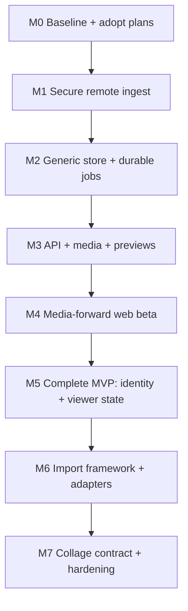

# Archive Library — Implementation Roadmap and Verification

## Current baseline (2026-07-10)

Repository head when this plan was written: `f6125d8` on `master`
(`Implement content manager controls`). The code already has:

- passive Twitter GraphQL observation and normalization;
- in-tab `TweetRecord` cache and standalone save path;
- direct extension-to-app WebSocket v1;
- SQLite Twitter posts/versions/media/files/FTS;
- original media download with Twitter CDN allowlist/politeness;
- frozen filename/sidecar generation;
- restart recovery for queued posts and operator status/archive/requeue/purge/
  verify CLI controls;
- 148 documented tests plus fake-extension integration harness.

Two baseline facts need explicit reconciliation when implementation starts:

1. `docs/plans/00-overview.md` still lists content-manager work as ready even
   though `f6125d8` implements the described M-1 through M-3 work. That plan
   status should be corrected in a separate owner-approved documentation
   change.
2. The current live-Chrome Tier 3 walkthrough remains recorded as not
   performed. It still gates deletion of legacy extension code. Remote/library
   work can proceed additively, but each affected Chrome path needs a live
   owner walkthrough before it replaces the fallback.

This roadmap is ordered as vertical, independently verifiable milestones.
Do not build every schema/UI/import idea in one branch.

## Milestone map



Schema foundations for later milestones can be introduced in M2, but unused UI
features stay out until their milestone. If M5 viewer-state fixture work is
ready earlier, its capture/schema slice may move into M2 so M4 can ship source
bookmark filters; do not duplicate the implementations.

## M0 — Baseline, plan adoption, and measurements

### Work

1. Run current devcontainer test/typecheck/build and the fake-extension loop.
2. Perform/record the existing live Chrome Tier 3 walkthrough for capture,
   standalone save, loopback service, media URL behavior, and experimental
   buttons where possible.
3. Confirm the target server/NAS OS, container capability, filesystem/dataset,
   local/private DNS, TLS/reverse proxy or Tailscale approach, storage roots,
   UID/GID, and backup tooling.
4. Record representative current DB/file counts and archive sizes; create a
   scrubbed test backup fixture if real data exists.
5. Adopt this plan set in `docs/plans/00-overview.md`, explicitly superseding
   only the UI/thumbnail scope statements described in `00-index.md`; update
   completed content-manager status.
6. Pick a working component name only if UI/package copy needs it. "Library
   server" remains sufficient otherwise.
7. Add a small ADR/decision record for modular monolith, remote extension-only
   edge, and SQLite-local-filesystem constraint if the repo establishes an ADR
   pattern.

### Gate

- Existing tests/build green and current behavior documented.
- A real remote deployment target and TLS plan are known.
- No legacy code deletion.
- Before/rollback backup available for any real database.

## M1 — Secure remote ingest with a durable extension edge

### Server slice

- Add one HTTP server/composition boundary and `/ingest/v2` WebSocket upgrade.
- Add schema migration runner only as needed for `capture_devices` and
  `ingest_receipts`; do not attempt the full generic schema yet.
- Implement one-time pairing, hashed per-device tokens, revoke/list CLI, frame
  limits, origin checks, structured error codes, batching, per-event ACKs,
  duplicate/conflicting-hash behavior, and backpressure limits.
- Map accepted Twitter v2 events into the existing ingest/downloader methods
  during this compatibility milestone.
- Retain v1 loopback behavior during transition; label it deprecated for remote.
- Serve minimal liveness/readiness endpoints with no library data.

### Extension slice

- Move server URL/device secret out of x.com localStorage into
  `chrome.storage.local`.
- Add `twmd-ingest` port between isolated content code and background worker.
- Add IndexedDB outbox/meta/dead-letter stores, monotonic sequence, priorities,
  batching, ACK deletion, coalescing/quota counters, reconnect/backoff, and
  explicit status.
- Keep standalone save intact.
- Add options/debug UI sufficient to configure/pair a server and see connected,
  queued, oldest, dropped/coalesced, last error, and token-revoked states.
- Do not remove the v1 direct client until v2 live Chrome verification passes.

### Deployment slice

- Add a development/test TLS proxy recipe and a first NAS Compose/native
  deployment draft.
- Verify the extension reaches `wss://` from a real x.com tab/browser profile.
- Require secure scheme for non-loopback endpoints.

### Likely file areas

```text
app/src/transport/http-server.js             new
app/src/transport/ingest-v2.js                new
app/src/auth/device-tokens.js                 new
app/src/db/migrations/*                       new
app/src/main.js                               compose new transport
extension/background/sync-worker.js           new
extension/content/ingest-client.js            new port sender
extension/content/index.js                    wire new sender
build.mjs / built manifest wiring             add background/options pieces
test/ingest-v2.test.ts                         new
test/extension-outbox.test.ts                  new
scripts/fake-extension.mjs                    v2/replay mode
```

Actual names may vary; preserve the module boundaries.

### Acceptance

1. Capture while server is down, restart Chrome/service worker, then start the
   server: queued events commit and are acknowledged exactly once.
2. Disconnect after server commit but before ACK: replay returns duplicate and
   deletes safely.
3. Explicit archive actions survive quota pressure; repeated seen events
   coalesce according to documented policy and counters are visible.
4. Revoking one device stops it without affecting other sessions/tokens.
5. Token/page storage inspection confirms the device secret is not accessible
   to x.com page JavaScript.
6. Non-loopback `ws://`, bad cert, bad origin, oversize frame, bad token, and
   event-ID hash conflict fail safely.
7. Existing loopback/standalone workflows still pass until deliberately
   retired.

### Commit slices

1. protocol/domain pure functions and DB receipts;
2. server v2 integration/fake client;
3. extension outbox/worker unit tests;
4. options/pairing and real integration;
5. deployment/live verification and v1 retirement decision.

## M2 — Generic canonical store, blob links, and persistent jobs

### Schema/migration slice

- Implement the migration framework and the canonical tables from
  `02-storage-and-files.md` needed through M5.
- Backfill Twitter service/accounts/items/versions/native IDs/relationships,
  media candidates, blobs, archive requests/outcomes, source snapshots, and
  FTS/filter projections.
- Build migration preflight, online backup, reports, equivalence checks, and
  refusal/rollback behavior.
- Add Twitter adapter that maps existing `TweetRecord` into generic projection
  and owns CDN/naming/sidecar rules through `@twmd/core`.
- Cut ingest to one canonical write path. Keep legacy tables read-only for one
  release/backup cycle, not as a second canonical store.

### File/job slice

- Separate physical `blobs` from `media_blobs` semantic relationships.
- Fix dedupe so every media asset links to an existing shared blob.
- Catalogue current legacy files and sidecars without moving them.
- Add atomic streaming temp/hash/promotion for new originals; eliminate full
  video buffering.
- Add persistent job/attempt scheduler with leases, dedupe keys, recovery,
  normalized errors, and per-adapter rate policy.
- Express archive item → asset downloads → sidecar/outcome as durable work.
- Enhance CLI status/archive/requeue/verify to use generic repositories/jobs.

### Data safety tests

- migrate a copy of a realistic file-backed legacy DB, never the only copy;
- compare legacy/generic counts and IDs using the required invariant report;
- two media assets with identical bytes yield one blob/two relationships;
- purge one reference preserves shared bytes and the second item's archive;
- crash at temp download, post-hash, post-rename, and pre/post DB commit;
- queue lease expires/reclaims without duplicate committed blob;
- replay all expected Twitter fixtures twice; second pass changes no identity
  counts and creates no duplicate versions/media;
- curation seed rows survive provider replay (even before UI exists).

### Acceptance

- All runtime reads/writes and downloader work use generic repositories.
- A migrated archive can serve/verify every valid prior media path and sidecar.
- Persistent jobs survive hard process kill/restart.
- Twitter outbound behavior remains CDN-only, polite, and credential-free.
- Migration/rollback drill succeeds on a disposable copy and produces a report
  understandable without reading SQL.

### Commit slices

1. migration runner + schema + repository unit tests;
2. Twitter projection adapter + fixture backfill;
3. blob/link/file-store refactor;
4. durable scheduler/archive handlers;
5. CLI/integration cutover + equivalence report;
6. read-only legacy-table retention marker/cleanup follow-up plan.

## M3 — Owner auth, HTTP API, media ranges, and preview cache

### Work

- Add owner bootstrap/login/session/CSRF and scoped hashed API tokens.
- Implement Fastify `/api/v1` resource/query foundation with OpenAPI schemas,
  error envelope, request IDs, limits, and cursor pagination.
- Implement item list/detail, archive request/retry, media metadata, services,
  accounts, tags/curation foundations, jobs/status, devices/token admin.
- Implement original media `GET/HEAD` with auth, range/conditional responses,
  path containment, signature MIME, stream cancellation, and immutable ETags.
- Implement preview profiles/cache/jobs using `sharp`; use captured video poster
  fallback until `ffmpeg` is deliberately packaged.
- Implement owner-only SSE status deltas.
- Add one read-only example client that lists items and downloads a preview.

### Likely file areas

```text
app/src/transport/routes/*                    new
app/src/auth/owner-auth.js                    new
app/src/auth/api-tokens.js                    new
app/src/application/*                         new use cases
app/src/db/repositories/*                     split from legacy db.js
app/src/media/range.js                        new
app/src/media/previews.js                     new
app/src/jobs/handlers/generate-preview.js     new
test/api-*.test.ts                            new
test/media-range.test.ts                      new
scripts/example-library-client.mjs            new
```

### Performance fixture

Create a deterministic synthetic seed generator (metadata rows, not huge real
media) large enough to test cursor/index behavior. Record `EXPLAIN QUERY PLAN`
expectations for common filters and a latency budget on the devcontainer/NAS
class hardware. Do not make wall-clock microbenchmarks flaky CI gates; fail on
lost indexes/full scans and use benchmark reports for budgets.

### Acceptance

1. Login/session/CSRF, read-only token, revoked token, and device-token scope
   isolation pass integration tests.
2. Item list combines filters with stable cursor paging and no duplicates.
3. Large MP4 streams and seeks without buffering into process memory.
4. Traversal/symlink/range/header abuse cannot escape storage or disclose data.
5. Preview stampede produces one job/file; deleting preview root rebuilds.
6. API responses expose stable IDs/URLs and no absolute paths/secrets.
7. Example client uses only documented `library:read media:read` scope.

## M4 — Media-forward web beta and owner curation

### Work

- Add Preact/plain-JS web workspace and production/dev build.
- Implement login shell, responsive navigation, error boundaries, API client,
  URL filter state, cursor list state, SSE refresh, and accessible primitives.
- Implement default archived media grid, filters for all generic data already
  captured, card actions, detail media/text/archive state, version/media view,
  archive/retry, and original opening.
- Implement item/media rating, local favorite, tags, note, and collections with
  optimistic concurrency.
- Implement Activity and basic Settings devices/tokens/system routes.
- Add Playwright seeded-browser flow and mobile/keyboard checks.

### Scope control

- uniform responsive grid first, not complex masonry;
- no collage editor;
- no automatic identity suggestions;
- no bulk curation until single-item correctness and selection semantics are
  proven;
- no raw provider URL hotlinking for seen-only items;
- no frontend read of SQLite/filesystem.

### Acceptance

- The owner can perform the core media review/curation loop without CLI/SQL.
  Source relationship and cross-account/person parts of the complete MVP are
  explicitly completed in M5.
- A refresh/back navigation preserves filters and sensible scroll context.
- Re-ingesting a rated/tagged item leaves curation unchanged and visible.
- Missing preview/original, failed/partial archive, deleted item, expired auth,
  and server disconnect all have clear states.
- UI at phone width, keyboard-only, reduced motion, and 200% zoom meets the
  defined checks.

### Commit slices

1. build/shell/auth/API client;
2. grid/filter/pagination;
3. detail/media/archive activity;
4. item/media curation + tags/collections;
5. activity/settings and browser/accessibility verification.

## M5 — Complete MVP: viewer bookmarks/likes, people, and account history

This milestone may overlap schema groundwork in M2 but owns end-to-end
semantics and UI.

### Capture/adapter work

- Expand Twitter contract additively with explicit field-presence and viewer
  liked/bookmarked evidence.
- Capture/verify viewer account identity or explicit browser-profile binding;
  detect contradictions/account switching.
- Add real/synthetic fixtures for Likes, Bookmarks, Home, Detail, and account
  switch/unattributed cases.
- Capture richer account profile/unavailability evidence only where real
  payloads support it.

### Domain/API work

- Implement account profile-period change algorithm and evidence.
- Implement owner person/viewer accounts, person-account links/history, and
  manual link/unlink/move/merge-preview use cases.
- Implement three-valued viewer state/history and `any/all/none/unknown` query
  semantics.
- Add API resources/filters from `06-identity-and-curation.md`.

### UI work

- Library source-like/source-bookmark filters with selected/any owner account;
- People/account list/detail, combined/separate media grid;
- account handle/name/availability observed timeline;
- owner/viewer account configuration and unattributed evidence repair;
- manual link/unlink/move flows with impact previews.

### Acceptance

Run every identity scenario listed in `06-identity-and-curation.md`, plus:

- browser account switch cannot silently attribute new bookmarks to the old
  account;
- timeline absence never clears a true relationship;
- handle A→B→A creates three observed periods on one account;
- manual cross-service person link changes combined queries, not item authorship;
- source state icons remain read-only and local favorite remains independent.

After this gate, the bundled web application meets the complete MVP definition
in `05-web-mvp.md`, including cross-account source relationship filters and
identity/history routes.

## M6 — Legacy import framework and real format adapters

### Framework work (can start before samples)

- add import source/batch/entry schema and job handlers;
- implement safe read-only inventory, symlink policy, checkpoint/resume, bounded
  hashing, manifest JSONL/summary/hash, approval/commit state, verification,
  and rollback preview;
- implement register/copy policy primitives and generic unresolved media adapter;
- add current frozen-filename/current-sidecar adapter from repository contracts;
- add synthetic safety/idempotency/collision tests.

### Sample-gated work

- collect the Phase 0 fixture pack for every historical layout;
- document timezone, directory meaning, sidecar versions, and authoritative
  versus duplicate roots;
- implement one adapter at a time with dry-run manifest review;
- run against a small copied/snapshot subset first;
- owner approves manifest/classification/collision policy;
- commit full batch, verify, and retain report.

### Acceptance

- Source tree bytes/metadata are unchanged after scan/commit/rollback tests.
- Re-running batch is idempotent and copies no already-managed hash.
- Ambiguous handle/time/account cases stay unresolved.
- Later live capture enriches a stub without losing blob/import/curation.
- Clean restore includes import manifests/provenance.

Do not make unknown legacy adapters a blocker for M1–M5.

## M7 — Collage contract, recovery drill, and hardening

### Collage API proof

- finalize read-only token recipe and stable selection/media representations;
- implement example collage consumer or test page outside the bundled UI that:
  filters person/account/tags/rating, performs seeded selection, stores opaque
  IDs, resolves later, and fetches previews;
- add bounded batch hydration only if real client calls need it;
- document compatibility/versioning and missing-item behavior.

### Operations proof

- finalize NAS Compose/native service and reverse proxy docs;
- add structured logs, health/readiness, metrics/status, low-space/backup/verify
  alerts;
- implement online backup command/barrier/manifest and layered verify commands;
- perform clean-host/container restore with originals, identities, curation,
  jobs, and imports;
- test migration rollback, preview loss, blob corruption, token leak/revoke, and
  original-root failure scenarios;
- run dependency/security review and outbound network audit.

### Acceptance

All operational gates in `08-operations-and-security.md` pass, and a collage
client has no filesystem/SQLite knowledge.

## Cross-cutting verification matrix

| Layer | Every relevant commit | Milestone gate | Owner/live gate |
|---|---|---|---|
| pure normalization/domain | Vitest unit + typecheck | all provider fixtures replayed | live payload fixture spot-check |
| SQLite/migrations | temp/file DB tests, FK checks | backup/migrate/equivalence/rollback | copy of real DB if present |
| ingest transport | protocol/outbox integration | crash/replay/quota/security matrix | real Chrome → remote WSS |
| jobs/media | injected network + real temp files | kill/restart/dedupe/redirect/range | small real CDN archive |
| API/auth | route contract/integration | scope/CSRF/abuse/performance | owner browser over deployed TLS |
| web | component/route tests | Playwright seeded flows/a11y | daily workflow walkthrough |
| importer | synthetic filesystem fixtures | sample subset manifest/commit/verify | owner approval per real layout |
| operations | config/command tests | backup/restore/failure drills | NAS/offsite job confirmation |

Continue the repo rule: every commit runs devcontainer
`npm test && npm run typecheck && npm run build`. Add focused commands for
Playwright, migration fixtures, synthetic benchmark, and restore/integration
tests; do not make every unit commit download browsers or contact real CDNs.

## Required test fixtures

- existing normalized Twitter operations and expected outputs;
- non-empty Bookmarks and Likes with explicit/implicit viewer state;
- Home/Detail states with explicit false/unknown relationships;
- edited post adding/removing media;
- user handle/name changes and account unavailable payloads;
- two owner accounts/account-switch attribution;
- shared identical blob across unrelated media assets;
- large/sparse MP4 for ranges without repository bloat (generate in test);
- current frozen archive files and sidecars;
- one scrubbed fixture set per actual legacy layout;
- seeded generic DB at small functional and large query-plan scales.

Real source fixtures are captured through the owner's documented passive
workflow. Tests never call x.com APIs.

## Threat/invariant tests that cannot be skipped

- credential/header stripping at capture, ingest, adapter, and final fetch;
- no source API host request in every code path;
- exact allowlist plus redirect/DNS/internal-host escape attempts;
- event/frame/body decompression/size/quota limits;
- event ID collision with changed payload;
- SQL/FTS injection and cursor tampering;
- path traversal, stored malicious path, symlink escape, MIME confusion;
- CSRF/CORS/origin/cookie/token scope and revocation;
- imported malicious filenames/sidecars/HTML-like content;
- shared-blob purge/reference race;
- job lease double-completion and crash boundaries;
- migration unknown/partial/checksum mismatch;
- logs and diagnostic export secret/private-content redaction.

## Performance budgets to establish, then measure

Do not invent hard numbers without the target NAS. In M0/M3 establish budgets
for:

- extension event insertion latency and outbox quota footprint;
- WSS reconnect/batch ingest throughput without blocking UI capture;
- common grid first-page and next-page queries at one million items;
- FTS/tag/person/bookmark combined query plans;
- preview generation and cache hit response;
- original video range memory usage/concurrent streams;
- archive worker NAS/network utilization under politeness limits;
- import inventory/hash throughput with interactive API still responsive;
- online backup duration/barrier and full/sampled verify rates.

Optimize from profiles/query plans. Do not add Redis, PostgreSQL, distributed
workers, or frontend virtualization solely from imagined scale.

## Risk register

| Risk | Consequence | Mitigation/gate |
|---|---|---|
| direct remote WebSocket from current content script is insecure/fragile | token exposure/data loss | M1 background ownership, extension storage, durable ACK protocol |
| current hash dedupe lacks many-to-many relation | purge/orphan semantics wrong | M2 blobs + media links, migration invariant tests |
| current raw version replacement loses observation history | rename/state history incomplete | meaningful source snapshots/profile periods before identity claims |
| source payload viewer identity is ambiguous | likes/bookmarks attributed to wrong account | nullable evidence, explicit binding, contradiction pause, fixtures |
| SQLite placed on network share | corruption/locking failures | enforce/document local DB filesystem |
| preview/media decoding untrusted files | process/resource/security issue | limits, signature checks, updated libraries, optional subprocess isolation |
| generic schema scope delays usable remote archive | no value delivered | M1 compatibility release before M2 migration |
| unknown legacy layouts are guessed | bad identity/metadata import | manifest-first sample-gated adapters |
| user-facing UI broadens current binding scope silently | plan conflict | M0 explicit overview adoption/supersession |
| backups capture DB/media inconsistently | failed restore/orphans | online DB backup + manifest + storage snapshot + restore drill |
| future provider tempts arbitrary URL/source writes | SSRF/ToS/privacy risk | capability-limited adapters, allowlists, no write interface |

## Decisions that need owner confirmation, with defaults

These do not block planning; use the recommended default until implementation
reaches the gate:

| Decision | Recommended default | Needed by |
|---|---|---|
| server host/storage | server runs on NAS with DB on local dataset | M0/M1 |
| remote network | private LAN/Tailscale HTTPS, no public ingress | M0/M1 |
| frontend stack | Preact + plain JS + esbuild in this repo | M3/M4 |
| HTTP framework | Fastify attached to current app process | M1/M3 |
| physical new originals | content-addressed managed root + logical legacy aliases | M2 |
| historical existing files | register in place first if permanently mounted; otherwise verified copy | M6 |
| preview formats | WebP profiles via sharp; captured poster for video initially | M3 |
| "me" identity | owner person linked to explicit viewer accounts | M5 |
| aliasing | manual only | M5 |
| seen scope | ingest all seen metadata; grid defaults archived | M1/M4 |
| source bookmarks vs local favorite | separate filters/fields | M2/M4/M5 |
| collage scope | read-only API proof, no editor in repo | M7 |

## Completion definition

The full project is complete—not merely demoable—when:

- a fresh extension/device can pair securely to the deployed remote server;
- offline/restart/replay behavior is durable, bounded, and visible;
- provider-generic canonical storage, blob relationships, jobs, and migrations
  have survived crash and restore tests;
- the owner can browse, filter, curate, archive/retry, and inspect identities
  from the web UI;
- multiple owner accounts' source likes/bookmarks and local favorites are
  correctly distinct;
- people can link accounts across services without rewriting source identity;
- historical files can be scanned/reviewed/imported idempotently once their
  adapters are approved;
- a read-only collage client works exclusively through stable API IDs/media
  routes;
- backups have been restored on a clean target and originals verified;
- source API writes/requests, secret leakage, arbitrary URL fetches, and direct
  client filesystem access remain structurally absent.
